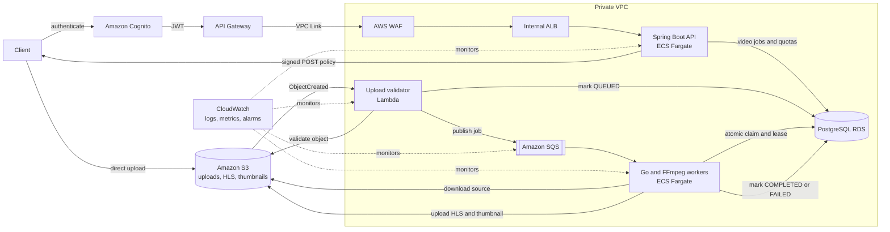

# Scalable Video Processing Platform

An event-driven backend that accepts secure direct-to-S3 video uploads, validates them, and asynchronously produces adaptive HLS streams and thumbnails with FFmpeg.

The project focuses on the distributed-systems problems behind media processing: duplicate delivery, atomic job ownership, long-running work, retries, autoscaling, secure uploads, and observable infrastructure.

## Highlights

- Secure Cognito JWT authentication and per-user video ownership
- Constrained presigned S3 POST uploads with file-size and content-type validation
- Event-driven ingestion through S3 notifications, Lambda, and SQS
- Atomic PostgreSQL job claiming with worker leases and fencing tokens
- Duplicate-safe, retryable Go workers with SQS visibility renewal and a DLQ
- Adaptive HLS renditions and JPEG thumbnails generated by FFmpeg
- Private AWS networking behind API Gateway, WAF, a VPC Link, and an internal ALB
- Reusable Terraform modules, Flyway migrations, autoscaling, backups, and CloudWatch alarms

## Architecture



## Processing flow

1. An authenticated user requests an upload policy from the API.
2. The API reserves the user's quota, creates a `PENDING_UPLOAD` job, and returns a constrained S3 POST policy.
3. The client uploads directly to S3 without proxying the video through the API.
4. An S3 event invokes Lambda, which verifies the exact object key, size, and content type.
5. Lambda atomically moves the job to `QUEUED` and publishes it to SQS.
6. A worker claims the database row, renews its lease and SQS visibility, and runs FFmpeg.
7. The worker uploads the HLS ladder and thumbnail, then marks the job `COMPLETED`.

```text
PENDING_UPLOAD -> QUEUED -> PROCESSING -> COMPLETED
                                      \-> FAILED
```

## Repository layout

| Directory | Purpose | Documentation |
|---|---|---|
| `api` | Spring Boot API, authentication, quotas, signed uploads, and Flyway migrations | [API README](api/README.md) |
| `worker` | Go consumer, atomic claiming, FFmpeg processing, and S3 output | [Worker README](worker/README.md) |
| `infra` | Terraform modules and dev/prod AWS environments | [Infrastructure README](infra/README.md) |

## Technology

Java 17, Spring Boot, Spring Security, Go, FFmpeg, PostgreSQL, Flyway, AWS Cognito, API Gateway, WAF, ALB, ECS Fargate, Lambda, S3, SQS, CloudWatch, ECR, CodePipeline, and Terraform.

## End-to-end demo

After deploying the dev environment, run the end-to-end script with AWS credentials that can manage users in the dev Cognito pool:

```bash
./test.sh ~/Downloads/test_video.mp4
```

The script creates or reuses `video-processing-test@example.com`, assigns a generated permanent password, obtains a Cognito access token, uploads the video, and polls until processing finishes. Set `TEST_USER_EMAIL` and `TEST_USER_PASSWORD` to use explicit test credentials, or set `ACCESS_TOKEN` to skip Cognito user management entirely.

The script creates a job, performs the signed multipart upload, and polls until processing finishes. A successful run prints the HLS master-playlist and thumbnail S3 keys.

## Component tests

```bash
# API
cd api && ./mvnw test

# Worker
cd worker && go test ./...

# Upload Lambda
cd infra/modules/s3_upload_notification/lambda && python3 -m unittest

# Terraform
terraform -chdir=infra/envs/dev validate
terraform -chdir=infra/envs/prod validate
```

## Current scope

This repository contains the backend and infrastructure. Playback currently returns private S3 object keys; a public client should add CloudFront with Origin Access Control and signed URLs or cookies before exposing HLS playback.

## Security

Never commit `.env` files, Terraform state, generated credentials, access tokens, or real `terraform.tfvars` files. If you discover a vulnerability, report it privately rather than opening a public issue.
